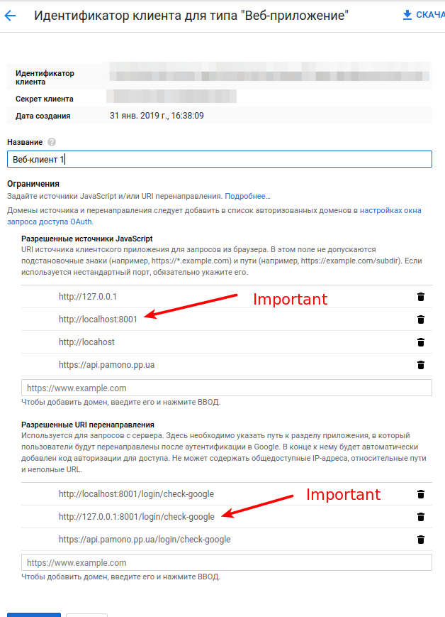
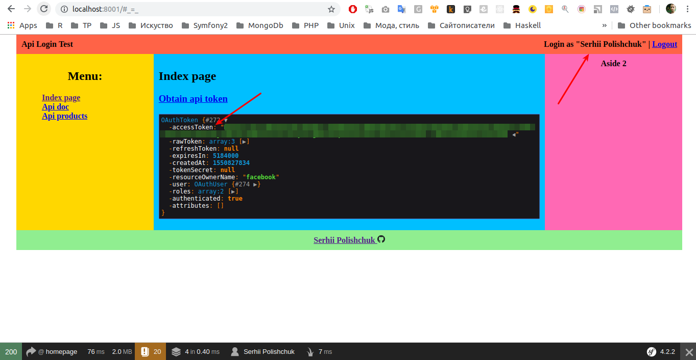

### OAuth test

#### Setup

1. Copy `.env` file into `.env.local`  
2. Put applications credentials in `env.local`, see [hwi/oauth-bundle section](./.env#L37)
3. Install dependencies and start server on `localhost:8001`
or any other domain that is used in redirect url setting.

```bash
composer install
bin/console server:start localhost:8001
```

4. Read how to setup Google Oauth application and get credentials
https://developers.google.com/identity/protocols/OAuth2  
Actualy you should have somethnig like that:



#### How it looks like


